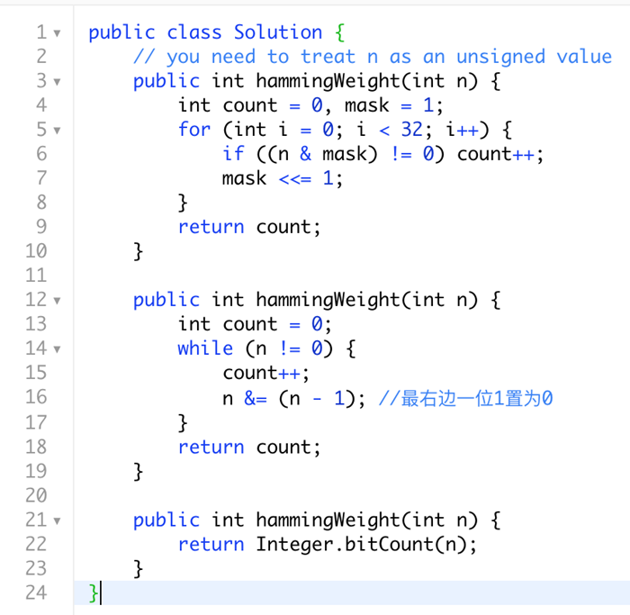

# 191. Number of 1 Bits

To solve the "191. Number of 1 Bits" problem in Java, we can apply the same approach as described earlier using bit manipulation.

### Approach: Bit Manipulation (Right-shifting)

The goal is to count how many `1` bits are present in the binary representation of a given unsigned integer. In Java, there is no direct concept of an unsigned integer, but we can still work with a 32-bit integer using bit manipulation.

### Algorithm:
1. Initialize a counter to `0`.
2. Loop through the bits of the number:
    - Check if the least significant bit is `1` by using the expression `(n & 1)`.
    - If the bit is `1`, increment the counter.
    - Right-shift the number to move to the next bit.
3. Repeat the process until the number becomes `0`.
4. Return the count of `1` bits.

### Java Code:

```java
public class Solution {
    // Function to count number of '1' bits in a given integer
    public int hammingWeight(int n) {
        int count = 0;
        
        // Loop until n becomes 0
        while (n != 0) {
            // Check if the last bit is 1
            count += (n & 1);
            // Right shift n to check the next bit
            n >>>= 1; // Unsigned right shift (to handle Java's signed integer)
        }
        
        return count;
    }
}
```

### Explanation:
- The bitwise `&` operation checks if the least significant bit is `1`.
- `n >>>= 1` is used to perform an **unsigned right shift** in Java. This is important because Java uses signed integers, so the `>>>` operator ensures that we shift bits logically and do not propagate the sign bit.
- The loop continues until `n` becomes `0`.

> Signed integers are stored in a computer using 2's complement.\
> It consists both negative and positive values but in different formats like (-1 to -128) or (0 to +127).\
> An unsigned integer can hold a larger positive value, and no negative value like (0 to 255).\
> Unlike C++ there is no unsigned integer in Java.
### Example Usage:

```java
public class Main {
    public static void main(String[] args) {
        Solution solution = new Solution();
        
        int n = 11; // Binary: 00000000000000000000000000001011
        System.out.println(solution.hammingWeight(n));  // Output: 3
    }
}
```

### Time Complexity:
- **Time Complexity:** O(1), as the loop runs a fixed number of times (32 times for a 32-bit integer).
- **Space Complexity:** O(1), since only a few variables are used.

This solution efficiently counts the number of '1' bits in the binary representation of the given integer.

### Other Solutions

