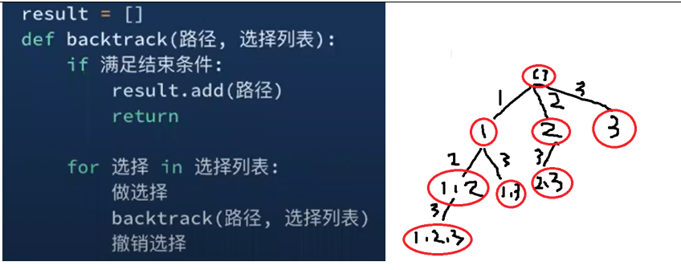

# 78. Subsets | M-92 | v - 不可重复，每次下一个


<!-- tabs:start -->

#### **Template 1**

```java
class Solution {
    public List<List<Integer>> subsets(int[] nums) {
        List<List<Integer>> res = new ArrayList<>();
        dfs(nums, 0, new ArrayList<>(), res);
        return res;
    }

    private void dfs(int[] nums, int start, List<Integer> curr, List<List<Integer>> res) {
        res.add(new ArrayList<>(curr));//[], [1], [1, 2] [1, 2, 3] [1, 3] [2, 3] [3]
        for(int i=start;i<nums.length;i++) {
            curr.add(nums[i]);
            dfs(nums, i+1, curr, res);
            curr.remove(curr.size()-1);
        }
    }
}
```


This implementation generates all subsets of a given array `nums` using a **depth-first search (DFS)** approach and **backtracking**. It systematically explores all possible subsets by making choices at each step and backtracking after exploring each path.

### Code Explanation

1. **Main Method (`subsets`)**:
    - The `subsets` method initializes an empty list `res` to store the results and calls the helper method `dfs` to start the DFS.
    - `res` will store each subset as a separate list, eventually containing all possible subsets of `nums`.

2. **DFS Method** (`dfs`):
    - The `dfs` method takes the current array `nums`, the starting index `start`, the current subset `curr`, and the results list `res`.
    - **Base Case**: The current subset (`curr`) is added to `res`. The list `curr` represents the subset built so far.
    - **Recursive Case**: For each element in `nums` starting from `start`, it:
        - Adds the element to the current subset (`curr.add(nums[i])`).
        - Calls `dfs` recursively to explore the subset that includes this element.
        - After exploring this path, backtracking is performed by removing the last element added (`curr.remove(curr.size()-1)`), allowing exploration of subsets that do not include the element.

### Example

For `nums = [1, 2, 3]`, the recursive calls will result in:

1. Starting with an empty subset: `[]`
2. Adding `1`: `[1]`
3. Adding `2` to `[1]`: `[1, 2]`
4. Adding `3` to `[1, 2]`: `[1, 2, 3]`
5. Backtracking to explore subsets without `3`: `[1, 3]`
6. Further backtracking to explore subsets without `1`: `[2]`, `[2, 3]`, `[3]`

The final result stored in `res` will be: `[[], [1], [1, 2], [1, 2, 3], [1, 3], [2], [2, 3], [3]]`.

### Complexity Analysis

- **Time Complexity**: \( O(2^n) \), where \( n \) is the length of `nums`, because each element can either be included or excluded from a subset.
- **Space Complexity**: \( O(n) \) for the recursive call stack and \( O(2^n) \) to store all subsets in `res`.

This solution is efficient for generating all subsets of a relatively small array due to the exponential growth in the number of subsets as the array length increases.
#### **Template 2**

```java
class Solution {
    public List<List<Integer>> subsets(int[] nums) {
        List<List<Integer>> res = new ArrayList<>();
        dfs(nums, 0, new ArrayList<>(), res);
        return res;
    }

    private void dfs(int[] nums, int start, List<Integer> curr, List<List<Integer>> res) {
        if(start==nums.length) {
            res.add(new ArrayList<>(curr));//[], [1], [1, 2] [1, 2, 3] [1, 3] [2, 3] [3]
            return;
        }
        //选
        curr.add(nums[start]);
        dfs(nums, start+1, curr, res);

        //不选
        curr.remove(curr.size()-1);
        dfs(nums, start+1, curr, res);
    }
}
```
This implementation of `subsets` generates all subsets of the array `nums` using a **DFS-based approach** with **explicit choices at each recursion level**. For each element in `nums`, the algorithm chooses either to include the element in the subset or exclude it, which leads to a binary decision tree representing all possible subsets.

### Explanation

1. **Main Method (`subsets`)**:
   - Initializes `res` to store the subsets.
   - Calls the helper function `dfs` with parameters: `nums`, starting index `0`, an empty `curr` list representing the current subset, and `res` to accumulate results.

2. **DFS Method (`dfs`)**:
   - **Base Case**: When `start` reaches the end of `nums`, the current subset `curr` is added to `res`. This subset is completed, so a deep copy is made using `new ArrayList<>(curr)`.
   - **Recursive Cases**:
      - **Include the Current Element**: Adds `nums[start]` to `curr`, calls `dfs` to explore subsets containing this element, and then removes it for backtracking.
      - **Exclude the Current Element**: After backtracking, the algorithm calls `dfs` again without adding the current element, exploring subsets that do not contain it.

### Example Walkthrough

For `nums = [1, 2, 3]`, the calls will unfold as:

1. Starting with an empty subset: `[]`
2. Adding `1`: `[1]`
   - Adding `2`: `[1, 2]`
      - Adding `3`: `[1, 2, 3]` (add to `res`)
      - Excluding `3`: `[1, 2]` (add to `res`)
   - Excluding `2`: `[1]`
      - Adding `3`: `[1, 3]` (add to `res`)
      - Excluding `3`: `[1]` (add to `res`)
3. Excluding `1`: `[]`
   - Adding `2`: `[2]`
      - Adding `3`: `[2, 3]` (add to `res`)
      - Excluding `3`: `[2]` (add to `res`)
   - Excluding `2`: `[]`
      - Adding `3`: `[3]` (add to `res`)
      - Excluding `3`: `[]` (add to `res`)

Final `res` will contain all subsets: `[[], [1], [1, 2], [1, 2, 3], [1, 3], [2], [2, 3], [3]]`.

### Complexity Analysis

- **Time Complexity**: \(O(2^n)\), where \(n\) is the length of `nums`. Each element has two choices (included or excluded), leading to \(2^n\) possible subsets.
- **Space Complexity**: \(O(n)\) for recursion depth and \(O(2^n)\) for storing subsets in `res`.

This approach is efficient and well-suited for generating all subsets due to its binary decision-based structure.
#### **Naive**
```java

```
<!-- tabs:end -->