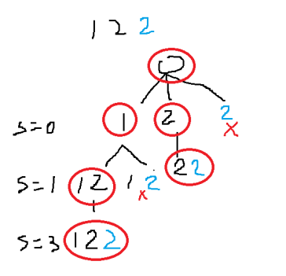
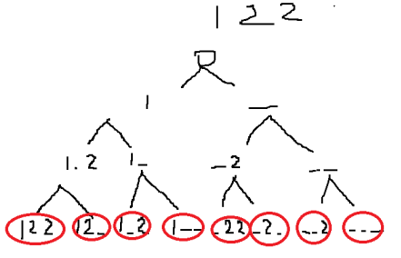
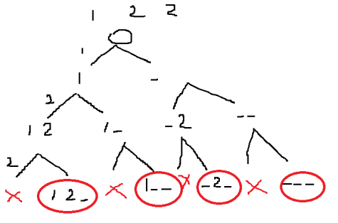
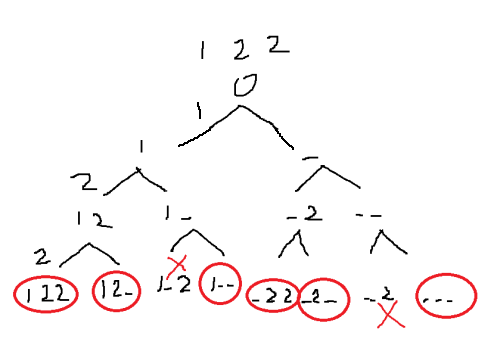

# 90. Subsets II | M-298

<!-- tabs:start -->

#### **Template 1**


```java
package tt.lab.algorithm.leetcode.dfs;

import java.util.ArrayList;
import java.util.Arrays;
import java.util.List;

public class SubsetsIIA_Best {
    public static void main(String[] args) {
        //[[], [1], [1, 2], [1, 2, 2], [2], [2, 2]]
        System.out.println(new SubsetsIIA_Best().subsetsWithDup(new int[]{1,2,2}));
        //[[], [1], [1, 2], [1, 2, 2], [1, 2, 2, 3], [1, 2, 3], [1, 3], [2], [2, 2], [2, 2, 3], [2, 3], [3]]
        System.out.println(new SubsetsIIA_Best().subsetsWithDup(new int[]{1,2,2,3}));
    }

    public List<List<Integer>> subsetsWithDup(int[] nums) {
        List<List<Integer>> res = new ArrayList<>();
        Arrays.sort(nums);
        dfs(nums, new ArrayList<>(), res, 0);
        return res;
    }

    private void dfs(int[] nums, List<Integer> list, List<List<Integer>> res, int start) {
        res.add(new ArrayList<>(list));
        for(int i=start;i<nums.length;i++) {
            if(i!=start && nums[i] == nums[i-1]) continue;//i!=start means that: if i==start, it is the first time in the loop
            list.add(nums[i]);
            dfs(nums, list, res, i+1);
            list.remove(list.size()-1);
        }
    }
}
```
#### **Template 2**
若不去重



错误去重



正确去重



```java
package tt.lab.algorithm.leetcode.dfs;

import java.util.ArrayList;
import java.util.List;

public class SubsetsIIB_Best {
    public static void main(String[] args) {
        //[[1, 2, 2], [1, 2], [1], [2, 2], [2], []]
        System.out.println(new SubsetsIIB_Best().subsets(new int[]{1,2,2}));
        //[[1, 2, 2, 3], [1, 2, 2], [1, 2, 3], [1, 2], [1, 3], [1], [2, 2, 3], [2, 2], [2, 3], [2], [3], []]
        System.out.println(new SubsetsIIB_Best().subsets(new int[]{1,2,2,3}));
    }


    public List<List<Integer>> subsets(int[] nums) {
        List<List<Integer>> res = new ArrayList<>();
        dfs(nums, 0, new ArrayList<>(), res);
        return res;
    }
    //1,2,2
//[[1, 2, 2], [1, 2], [1, 2], [1], [2, 2], [2], [2], []] incorrect1
    //[[1, 2], [1], [2], []] incorrect2
//[[], [1], [1, 2], [1, 2, 2], [2], [2, 2]] correct
    private void dfs(int[] nums, int start, List<Integer> curr, List<List<Integer>> res) {
        if(start==nums.length) {
            res.add(new ArrayList<>(curr));
            return;
        }

        //选
        curr.add(nums[start]);
        dfs(nums, start+1, curr, res);

//        int next = start+1;
//        while(next<nums.length && nums[next] == nums[start]) {
//            next++;
//        }
        while(start+1<nums.length && nums[start+1] == nums[start]) {
            start++;
        }

        //不选
        curr.remove(curr.size()-1);
//        dfs(nums, next, curr, res);
        dfs(nums, start + 1, curr, res);
    }
}
```

#### **Naive**
```java

```
<!-- tabs:end -->